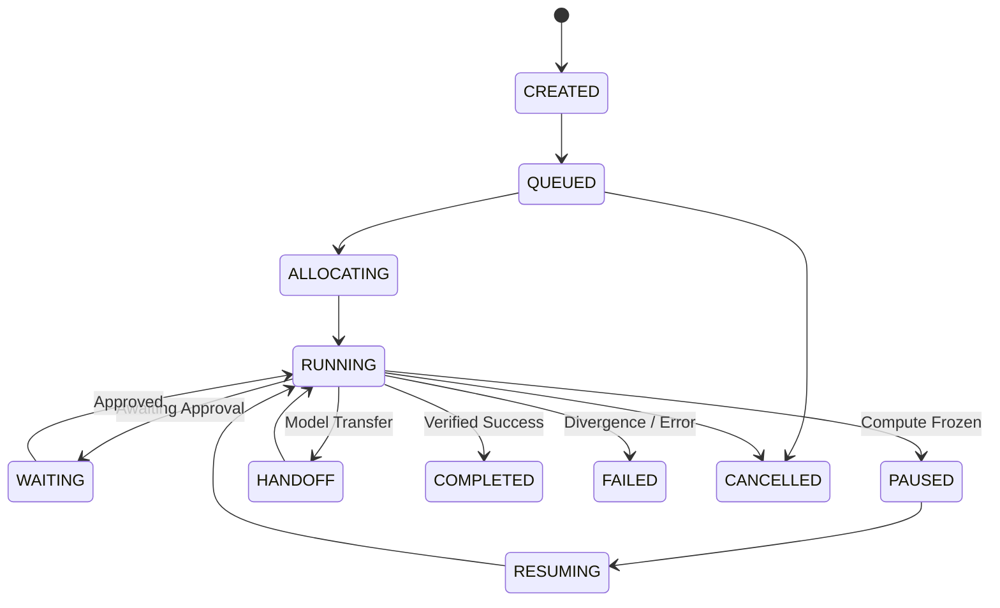

# Meshly Architecture & Systems Design

> **Meshly is the operating layer for autonomous workers.**
> Run agents like infrastructure. Schedule their compute. Preserve their state. Control their authority. Verify their work.

---

## 1. Core Architectural Thesis

Today's agent frameworks treat agents as ephemeral prompt loops running inside an application process. When agents execute in production, this leads to five critical failures:
1. **Unbounded Infrastructure Burn:** Cold-booting new browsers and VMs for every tool call wastes seconds and budgets.
2. **State Loss on Disconnects:** If a worker or connection drops, hours of multi-step context are obliterated.
3. **Privilege Creep:** Sub-agents spawned recursively can escalate privileges, execute arbitrary destructive tools, or overspend budgets.
4. **Agent Delusion & Hallucination:** Agents claim a task succeeded ("I clicked the button and updated the ledger") even when the external DOM failed to load or the database was locked.
5. **Orphaned Compute:** Unclaimed cloud VMs and browser sessions run indefinitely, leaking credentials and cloud spend.

**Meshly solves this by decoupling the agent from the execution environment:**
- **Meshly** decides which agent should run, what compute it needs, what it is allowed to do, what it remembers, and whether the physical world actually changed.
- **Solari** provides the ephemeral execution environment (Cloud Browser, MicroVM Sandbox, GUI Desktop).

```
┌──────────────────────────────────────────────────────────────────────────┐
│                         LLM / AGENT LOGIC                                │
│       (Claude, OpenAI, DeepSeek, Local Models, LangGraph, Custom)        │
└────────────────────────────────────┬─────────────────────────────────────┘
                                     │ Intent & Tool Actions
                                     ▼
┌──────────────────────────────────────────────────────────────────────────┐
│                         MESHLY OPERATING LAYER                           │
│  ┌───────────────┐ ┌───────────────┐ ┌───────────────┐ ┌──────────────┐  │
│  │   SCHEDULER   │ │   AUTHORITY   │ │    CONTEXT    │ │   REALITY    │  │
│  │ (Multi-Factor │ │   (Monotonic  │ │  (Zero-Loss   │ │    ENGINE    │  │
│  │    Scoring)   │ │  Narrowing)   │ │    Handoff)   │ │ (Verifiers)  │  │
│  └───────┬───────┘ └───────┬───────┘ └───────┬───────┘ └──────┬───────┘  │
│          │                 │                 │                │          │
│          ▼                 ▼                 ▼                ▼          │
│  ┌──────────────────────────────────────────────────────────────────┐    │
│  │                    ENVIRONMENT BROKER & LEASES                   │    │
│  │      (First-Class Leases • Warm-Pool Recycling • Sub-Second)     │    │
│  └─────────────────────────────────┬────────────────────────────────┘    │
└────────────────────────────────────┼─────────────────────────────────────┘
                                     │ Allocation & Leases
                                     ▼
┌──────────────────────────────────────────────────────────────────────────┐
│                 SOLARI CLOUD INFRASTRUCTURE SUBSTRATE                    │
│   ┌─────────────────────┐ ┌───────────────────┐ ┌────────────────────┐   │
│   │   CLOUD BROWSERS    │ │ MICROVM SANDBOXES │ │    GUI DESKTOPS    │   │
│   │ (Stealth, Profiles, │ │ (Code Exec, Files,│ │ (VNC Streams, SAP, │   │
│   │      Replays)       │ │     Network)      │ │   Pause/Resume)    │   │
│   └─────────────────────┘ └───────────────────┘ └────────────────────┘   │
└──────────────────────────────────────────────────────────────────────────┘
```

---

## 2. The 5 Core Primitives

Meshly is architected around five fundamental verbs:

### 1. `SCHEDULE`
Autonomous workers are not spawned arbitrarily. Meshly's scheduler calculates a multi-factor score across queue candidates:
$$\text{Score} = (\text{priority} \times 20) + \text{deadlineUrgency} + \text{warmPoolBonus} + \text{affinityBonus} - \text{budgetPenalty}$$
Workers are dispatched onto warm environments with exact profile affinity (e.g. pre-authenticated session profiles or pre-cloned repositories), eliminating 5–30s cold-boot delays.

### 2. `PERSIST`
Worker state is strictly separated into:
- **Logical Worker Context:** Objective, step index, recent actions, and artifacts.
- **3-Tier Budgeted Memory:**
  - **HOT (Active Context Window):** Strictly capped to prevent token exhaustion.
  - **WARM (Working Scratchpad):** Fast structured data transferred during worker handoffs.
  - **COLD (Archival Storage):** Historical evidence and large logs.
- **Semantic Checkpoints:** Checkpoints capture not only variables, but verified external world states. Handoffs between models (e.g. from a reasoning model to a fast code execution worker) happen with zero loss.

### 3. `AUTHORIZE`
Authority in Meshly is **monotonic and pre-execution intercepted**:
$$A_{\text{child}} \subseteq A_{\text{parent}}$$
- Child workers can only hold a subset of parent tools, domains, write targets, and spend caps.
- Every action intent is intercepted *before* any tool or network call touches an environment.
- Expired leases trigger immediate action denial (`LEASE_EXPIRED`).

### 4. `VERIFY`
Meshly decouples the agent's claim from physical world reality:
1. **Precondition Guard:** Asserts external environment state *before* action execution.
2. **Action Execution:** Runs the tool or model invocation.
3. **Postcondition Check:** Queries the external environment independently (DOM selector, database table, process exit code).
4. **Evidence Bundle:** Generates a tamper-evident, content-addressed bundle containing state diffs, replay URLs, and a SHA-256 checksum. If reality does not match the claim, automatic **SAGA compensation** rolls back uncommitted actions.

### 5. `RESUME`
Meshly treats environments as suspensible virtual hardware:
- When a worker pauses, hits an approval gateway, or runs out of lease duration, the underlying microVM or desktop is frozen via Solari's pause API in <800ms.
- When approved or scheduled, compute resumes instantly from the exact memory snapshot without re-running initialization steps.

---

## 3. Strict State Machine Separation

Meshly strictly separates **Worker Lifecycle States** from **Environment Lifecycle States**:



Environment states follow a distinct infrastructure lifecycle: `COLD` → `STARTING` → `READY` → `BUSY` → `IDLE` (Warm Pool) → `PAUSED` → `RESUMING` → `LOST` → `TERMINATING` → `TERMINATED`.

When a worker completes, its environment is **never leaked**; it is returned to the `IDLE` warm pool or safely recycled.
